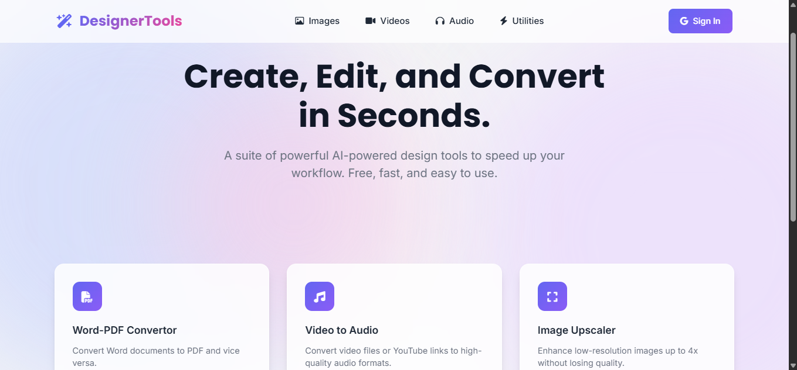

# 🛠️ DesignerTools.app
### The Ultimate AI-Powered Toolkit for Modern Creators

---

## 🌟 Why DesignerTools?
We built **DesignerTools** to eliminate repetitive tasks. Whether you are a YouTuber, Podcaster, or Graphic Designer, our tools help you finish hours of work in seconds.

## 🚀 Key Features

### 🖼️ Image Tools
* **[AI Background Remover](https://designer-tools.app/remove_background)**: Professional-grade BG removal using neural networks.
* **[Image Converter](https://designer-tools.app/convert)**: Change formats for Images seamlessly.
* **[Object Remover](https://designer-tools.app/object_remover)**: Clean up your photos by removing unwanted objects.
* **[Image Upscaler](https://designer-tools.app/upscale)**: Enhance image quality and resolution instantly.
* **[Image Editor](https://designer-tools.app/image_editor)**: Quick and powerful online photo editing.
* **[Image Compressor](https://designer-tools.app/image_compressor)**: Reduce file size without losing quality.

### 🎬 Video & Audio Tools
* **[Remove Silence](https://designer-tools.app/remove_silence)**: Automatically detect and cut silence from your videos.
* **[Video Downloader](https://designer-tools.app/video_downloader)**: Save videos from your favorite platforms.
* **[Video Converter](https://designer-tools.app/video_converter)**: Change video formats with high precision.
* **[Video to Audio](https://designer-tools.app/video_to_audio)**: Extract high-quality sound from any video file.
* **[Subtitle Extractor](https://designer-tools.app/subtitle_extractor)**: Get text captions from your videos easily.

### 📄 Document & Converter Tools
* **[Smart OCR](https://designer-tools.app/ocr)**: Convert images and scanned docs into editable text.
* **[Image to PPTX](https://designer-tools.app/image_to_pptx)**: Convert your images into professional PowerPoint slides.
* **[Word to PDF](https://designer-tools.app/word_pdf_convertor)**: Fast and reliable document conversion.

---

## 🛠 Built With
* **Framework:** Next.js
* **Backend:** Python (FastAPI/Flask) for core logic & AI processing
* **Styling:** Tailwind CSS
* **Infrastructure:** DigitalOcean
* **AI Models:** OpenAI API & Custom Python Scripts

---
## 📬 Feedback & Support
Found a bug or have a feature request? Please [open an issue](https://github.com/eissay/DesignerTools-Creative-Suite/issues).
